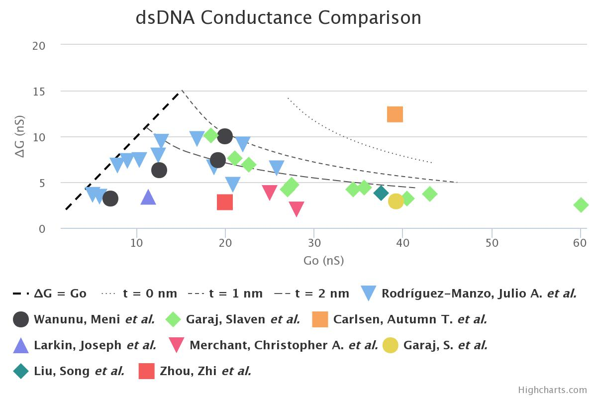

# Pore Compare
Comparison of conductance data in the solid-state nanopore literature.

Check out the site [here](http://parkin.github.io/pore-compare/).

Inspired by [DNA Translocation in Nanometer Thick Silicon Nanopores](http://pubs.acs.org/doi/abs/10.1021/acsnano.5b02531).



## Contributing

To contibute published data, please:

1. Edit the data at [app/data/data.json](app/data/data.json) and follow its formatting.
2. Add your bibtex bibliography entry to [app/assets/bib.bib](app/assets/bib.bib).

To add your data, please send in a pull request or [create a new issue](https://github.com/parkin/pore-compare/issues).

Other contributions, such as style and functionality improvements, are welcome!

## Development

### Dependencies

The only development dependency is [nodejs](https://nodejs.org/).

### Quick Start

```bash
git clone https://github.com/parkin/pore-compare.git
cd pore-compare
npm install
npm start
```

Then point your browser to [http://localhost:8080/](http://localhost:8080/) and you should see the site!

### Build tasks

We use [Gulp](http://gulpjs.com/) to run build tasks. The site source code is in the [app](app) directory. Running the [`gulp build`](tasks/build.js) task will compile what it needs to and copy everything else to the `build` directory.

Running `gulp connect` will build the site and start a server, serving from the `build` directory.

### Deploying

The project is hosted on Github Pages, using the `gh-pages` branch. There is an npm task to deploy the site to the gh-pages branch.

```
npm run deploy
```

*This will push to the `gh-pages` branch, so you must have access to the remote gh-pages branch to use this!*
*Note that this will push to `gh-pages` with the force `-f` flag!*
